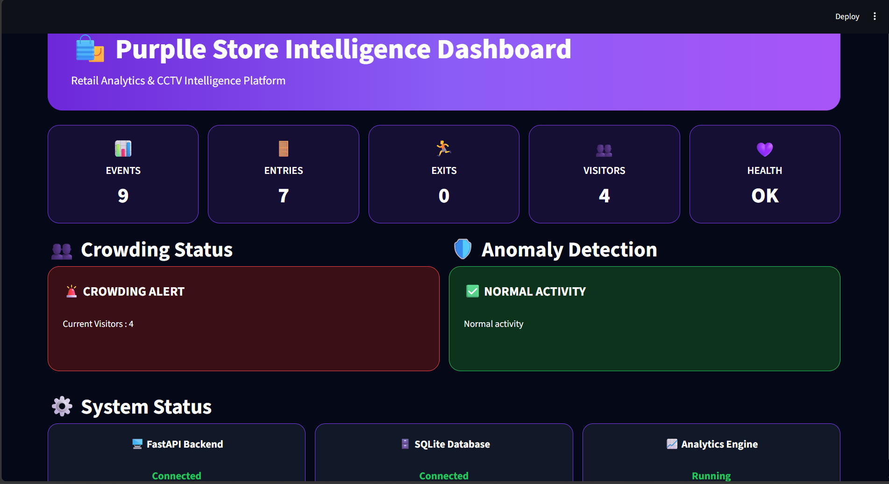
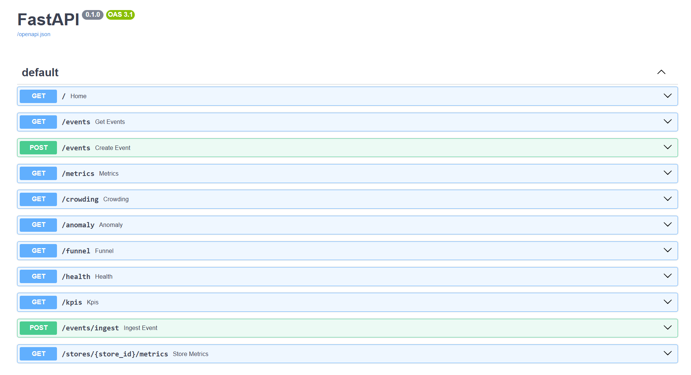
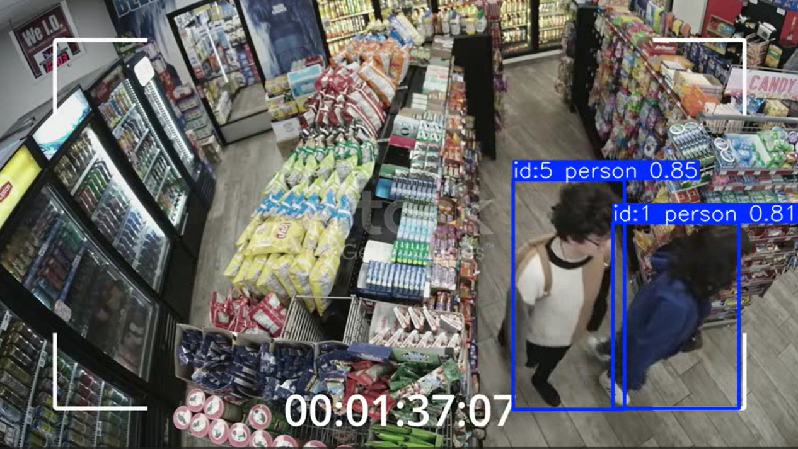

# 🛍️ Purplle Store Intelligence System

AI-powered retail analytics platform built for the **Purplle Store Intelligence Challenge 2026**.

The system processes CCTV footage, tracks customer movement, generates store events, computes operational KPIs, and provides business insights through REST APIs and an interactive dashboard.

---

## 🚀 Features

### Computer Vision Pipeline

- YOLOv8 Person Detection
- Multi-Person Tracking
- Entry Detection
- Exit Detection
- Re-entry Detection
- Zone Tracking
- Visitor Session Tracking

### Analytics Engine

- Occupancy Analytics
- Peak Occupancy Tracking
- Dwell Time Analytics
- Funnel Analytics
- KPI Dashboard
- Crowding Detection
- Anomaly Detection

### Platform

- FastAPI Backend
- Interactive Streamlit Dashboard
- SQLite Event Storage
- Swagger API Documentation
- Docker Deployment
- Health Monitoring Endpoint

---

## 🏗️ System Architecture

```text
CCTV Video
     ↓
YOLOv8 Detection
     ↓
Person Tracking
     ↓
Event Generation
     ↓
SQLite Database
     ↓
Analytics Engine
     ↓
FastAPI APIs
     ↓
Streamlit Dashboard
```

---

## 📂 Project Structure

```text
store-intelligence-system/

├── app/
│   ├── main.py
│   ├── database.py
│   ├── models.py
│   ├── occupancy.py
│   ├── dwell_time.py
│   ├── kpi.py
│   └── ...

├── dashboard/
│   └── app.py

├── pipeline/
│   └── track_people.py

├── sample_data/

├── tests/

├── docs/
│   ├── dashboard.png
│   ├── swagger.png
│   ├── camera_output.png
│   └── camera_output_2.png

├── Dockerfile
├── docker-compose.yml
├── README.md
├── DESIGN.md
├── CHOICES.md
├── requirements.txt
└── store.db
```

---

## 📊 Dashboard Features

The Streamlit dashboard provides:

- Total Events
- Entry Count
- Exit Count
- Active Visitors
- System Health Status
- Crowding Alerts
- Anomaly Monitoring
- KPI Overview

---

# 📸 Screenshots

## Dashboard

Interactive retail analytics dashboard.



---

## Swagger API Documentation

FastAPI auto-generated API documentation.



---

## Detection Pipeline Output

YOLOv8 detecting and tracking customers inside the retail store.



---

## Visitor Tracking Example 2

Multi-person tracking with unique visitor IDs.


---

# 🐳 Running With Docker

Build and start the application:

```bash
docker compose up --build
```

FastAPI:

```text
http://localhost:8000
```

Swagger Documentation:

```text
http://localhost:8000/docs
```

---

# 💻 Running Without Docker

Install dependencies:

```bash
pip install -r requirements.txt
```

Start FastAPI:

```bash
uvicorn app.main:app --reload
```

Start Dashboard:

```bash
streamlit run dashboard/app.py
```

---

# 🎥 Running The Detection Pipeline

Process CCTV footage:

```bash
python pipeline/track_people.py
```

The pipeline:

- Detects people using YOLOv8
- Tracks visitors across frames
- Generates store events
- Stores results in SQLite

Generated events are persisted in:

```text
store.db
```

---

# 🔌 API Endpoints

## Event APIs

- GET /events
- POST /events
- POST /events/ingest

## Analytics APIs

- GET /metrics
- GET /crowding
- GET /anomaly
- GET /funnel
- GET /kpis

## Health API

- GET /health

## Store Analytics

```text
GET /stores/{store_id}/metrics
```

Example:

```text
GET /stores/STORE_BLR_002/metrics
```

---

# ❤️ Health Monitoring

Health endpoint verifies:

- API Availability
- Database Connectivity
- Service Status

Example Response:

```json
{
  "status": "healthy",
  "database": "connected",
  "api": "running",
  "service": "store-intelligence-system"
}
```

---

# 📄 Documentation

Additional documentation included:

- DESIGN.md
- CHOICES.md

These documents explain:

- Architecture Decisions
- Engineering Tradeoffs
- Scalability Considerations
- Future Improvements

---

# 🔮 Future Improvements

- Multi-Camera Support
- PostgreSQL Integration
- Real-Time Event Streaming
- Staff/Customer Differentiation
- Advanced Visitor Re-Identification
- Cloud Deployment

---

# 🛠️ Tech Stack

- Python
- YOLOv8
- OpenCV
- FastAPI
- Streamlit
- SQLite
- SQLAlchemy
- Docker

---

# 👩‍💻 Author

**Pavani Ravuvari**

Purplle Store Intelligence Challenge 2026